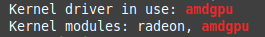

# Como Configurar o Driver das Placas AMD no Linux Mint

O Linux Mint já vem com os drivers Mesa, Radeon e Amdgpu instalados por padrão. Só é necessário entender qual o melhor driver dependendo do seu cenário.

## **Drivers da GPU AMD**

## **Radeon**
  
É o driver de vídeo Open Source legado para GPUs AMD. Geralmente possui desempenho inferior ao Amdgpu e não possui suporte a API Vulkan.

**Está presente nos chips:**

* R5, R7 e R9 
* Radeon HD 2000, 3000, 4000, 5000, 6000, 7000 e 8000

**Amdgpu**

Vem configurada como padrão nas placas mais novas. Possui suporte a API Vulkan.

**Amdgpu-pro**

Não vem instalado nas distros por estar em fase . É necessário baixar do site da AMD porém não tem suporte para as versões mais recentes das distros.

## **Instalei o Linux Mint e agora?**

Para verficar qual driver está sendo usado basta digitar no terminal: 

>lspci -k | grep radeon

>lspci -k | grep amdgpu

A saída esperada é esta:

Isto quer dizer que você possui os drivers radeon e amdgpu instalados e é o amdgpu que está em uso.

Se a sua placa de video estiver na [listagem de modelos](#modelos) abaixo basta alterar as configurações do Grub e atualizado da senguinte forma:

Abra o arquivo /etc/default/grub com o editor que preferir, adicione o comando abaixo a linha **GRUB_CMDLINE_LINUX** e salve o arquivo.
> radeon.cik_support=0 amdgpu.cik_support=1 radeon.si_support=0 amdgpu.si_support=1

Para atualizar o Grub basta o comando:

> sudo update-grub

**Ao reiniciar é só verificar qual driver está em uso.**

## **Modelos Amdgpu** 

Modelos   | GPU Model
--------- | --------- 
AMD Radeon HD 7990 | Tahiti XT2
AMD Radeon HD 8990| Tahiti XT2
AMD Radeon Sky 900| Tahiti PRO
AMD Radeon HD 7970 GHz Edition | Tahiti XT2
AMD Radeon HD 8970  | Tahiti XT2
AMD Radeon HD 7970 | Tahiti XT
AMD Radeon R9 280X | Tahiti XTL
AMD Radeon Sky 700 | Tahiti PRO
AMD Radeon HD 7950 Boost | Tahiti PRO
AMD Radeon R9 280 | Tahiti PRO
AMD Radeon HD 8950 | Tahiti PRO
AMD Radeon HD 7950 | Tahiti PRO
AMD Radeon HD 7870 XT | Tahiti LE
AMD Radeon R9 M385 | Strato XT
AMD Radeon R9 M385X | Strato XT
AMD Radeon R9 M470X | Bonaire
AMD Radeon R9 260 | Bonaire XT
AMD Radeon HD 8770 | Bonaire XT
AMD Radeon HD 7790 | Bonaire XT
AMD Radeon R7 260X | Bonaire XTX
AMD Radeon R9 M470 | Bonaire
AMD Radeon R7 360 | Tobago PRO
AMD Radeon R7 360E | Tobago PRO
AMD Radeon R9 360 | Tobago PRO
AMD Radeon R7 260 | Boaire PRO
AMD Radeon R9 35 | Tobago PRO
AMD Radeon R9 295X2 | Hawaii XT
AMD Multiuser GPU | Hawaii
AMD Radeon R9 390X | Grenada XT
AMD Radeon R9 290X | Hawaii XT
AMD Radeon R9 390 | Grenada PRO
AMD Radeon R9 290 | Hawaii PRO
AMD Radeon Sky 500 | Pitcairn XT
AMD Radeon HD 7870 GHz Edition | Pitcairn XT
AMD Radeon R9 270X | Curacao XT
AMD Radeon R9 370X | Trinidad XT
AMD Radeon HD 8870 | Pitcairn XT
AMD Radeon HD 8860 | Pitcairn XT
AMD Radeon R9 270 | Curacao PRO
AMD Radeon R9 370 | Trinidad PRO
AMD Radeon R7 370 | Trinidad PRO
AMD Radeon R7 265 | Pitcairn PRO
AMD Radeon HD 7850 | Pitcairn LE
AMD Radeon R9 M375X | Tropo XTX
AMD Radeon R9 M375 | Tropo XTX
AMD Radeon R7 M380 | Tropo XTX
AMD Radeon HD 8760 | Cape Verde XT
AMD Radeon R9 M360 | Tropo XT
AMD Radeon R9 A375 | Tropo XT
AMD Radeon R9 M380 |Tropo XTX
AMD Radeon R9 M370X Mac Edition | Tropo XT
AMD Radeon HD 7770 GHz Edition | Cape Verde XT
AMD Radeon R7 250X | Cape Verde XT
AMD Radeon R7 250XE | Cape Verde XT
AMD Radeon R7 M465X | Cape Verde
AMD Radeon R9 255 | Cape Verde PRX
AMD Radeon R9 M360 | Tropo LE
AMD Radeon HD 7750 | Cape Verde PRO
AMD Radeon R7 250E | Cape Verde PRO
AMD Radeon HD 8740 | Cape Verde PRO
AMD Radeon HD 7730 | Cape Verde LE
AMD Radeon HD 8730 | Cape Verde LE
AMD Radeon R7 M350 | Lithio
AMD Radeon R7 350X | Samoa XT
AMD Radeon R7 M370 | Lithio
AMD Radeon R5 340X | Samoa XT
AMD Radeon R7 250 | Oland XT
AMD Radeon HD 8670 | Oland XT
AMD Radeon R9 A360 | Lithio
AMD Radeon R5 340 | Oland XT
AMD Radeon R7 340 | Oland XT
AMD Radeon R7 430 | Oland XT
AMD Radeon R7 350 | Oland XT
AMD Radeon R5 M330 | Exo
AMD Radeon R5 M430 | Oland
AMD Radeon R5 M435 | Oland
AMD Radeon R5 M420 | Oland
AMD Radeon R7 M440 | Oland
AMD Radeon R5 M320 | Exo
AMD Radeon R5 A330 | Exo
AMD Radeon R5 M335 | Exo
AMD Radeon R5 330 | Oland
AMD Radeon HD 8570 | Oland
AMD Radeon R5 240 | Oland
AMD Radeon R7 240 | Oland PRO